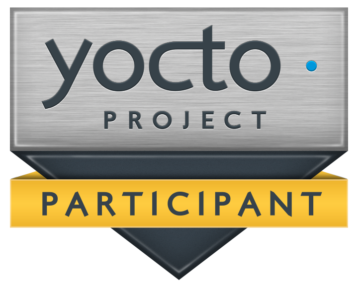

# Awesome Yocto Project 

> It's not an embedded Linux Distribution, It creates a custom one for you.

## Contents

- [Books](#books)
- [Development tools](#development-tools)
- [Documentation](#documentation)
- [Layers](#layers)
- [Services](#services)
- [Online courses](#online-courses)
- [Presentations](#presentations)
- [Trainings](#trainings)

## Books

- [Embedded Linux Development using Yocto Projects (2nd edition, 2017)](https://www.packtpub.com/virtualization-and-cloud/embedded-linux-development-using-yocto-projects-second-edition) - Short 162 pages long read.
- [Embedded Linux Development Using Yocto Project Cookbook (2nd edition, 2018)](https://www.packtpub.com/virtualization-and-cloud/embedded-linux-development-using-yocto-project-cookbook-second-edition) - 456 pages long read.
- [Embedded Linux Development with Yocto Project (2014)](https://www.packtpub.com/application-development/embedded-linux-development-yocto-project) - Short 142 pages long read.
- [Embedded Linux Projects Using Yocto Project Cookbook (2015)](https://www.packtpub.com/virtualization-and-cloud/embedded-linux-projects-using-yocto-project-cookbook) - 324 pages long read.
- [Embedded Linux Systems with the Yocto Project (2016)](https://dl.acm.org/citation.cfm?id=3051933) - 480 pages long read.
- [Learning Embedded Linux Using the Yocto Project (2015)](https://www.packtpub.com/application-development/learning-embedded-linux-using-yocto-project) - 334 pages long read.
- [Yocto for BeagleBone Black (2015)](https://www.packtpub.com/hardware-and-creative/yocto-beaglebone) - Short 144 pages long read specific to the BeagleBone Black.
- [Yocto for Raspberry Pi (2016)](https://www.packtpub.com/hardware-and-creative/yocto-raspberry-pi) - Short 214 pages long read specific to the Raspberry Pi.

## Development tools

- [autobuilder-worker-prereq-tests](https://git.yoctoproject.org/cgit.cgi/poky/plain/scripts/autobuilder-worker-prereq-tests) - Checks if all needed configuration is present on new autobuilder workers.
- [bitbake-prserv-tool](https://git.yoctoproject.org/cgit.cgi/poky/plain/scripts/bitbake-prserv-tool).
- [bitbake-whatchanged](https://git.yoctoproject.org/cgit.cgi/poky/plain/scripts/bitbake-whatchanged) - Print what will be done between the current and last builds.
- [buildhistory-collect-srcrevs](https://git.yoctoproject.org/cgit.cgi/poky/plain/scripts/buildhistory-collect-srcrevs) - Collects recorded SRCREV values from buildhistory and reports on them.
- [buildhistory-diff](https://git.yoctoproject.org/cgit.cgi/poky/plain/scripts/buildhistory-diff) - Reports significant differences in the buildhistory repository since a specific revision.
- [buildstats-diff](https://git.yoctoproject.org/cgit.cgi/poky/plain/scripts/buildstats-diff) - Compares buildstats from two different builds.
- [combo-layer](https://git.yoctoproject.org/cgit.cgi/poky/plain/scripts/combo-layer).
- [combo-layer-hook-default.sh](https://git.yoctoproject.org/cgit.cgi/poky/plain/scripts/combo-layer-hook-default.sh).
- contrib
  - [bbperf/bb-matrix-plot.sh](https://git.yoctoproject.org/cgit.cgi/poky/plain/scripts/contrib/bb-perf/bb-matrix-plot.sh) - Generates tree views from .dat files generated  with bb-matrix.sh.
  - [bbperf/bb-matrix.sh](https://git.yoctoproject.org/cgit.cgi/poky/plain/scripts/contrib/bb-perf/bb-matrix.sh) - Generates .dat file with image build statistics (core-image-sato) considering all combinations of BB_RANGE and PM_RANGE values.
  - [bbperf/buildstats-plot.sh](https://git.yoctoproject.org/cgit.cgi/poky/plain/scripts/contrib/bb-perf/buildstats-plot.sh) - Visualizes data generated with buildstats.sh .
  - [bbperf/buildstats.sh](https://git.yoctoproject.org/cgit.cgi/poky/plain/scripts/contrib/bb-perf/buildstats.sh) - Generates statstics about builds.
  - [bbvars.py](https://git.yoctoproject.org/cgit.cgi/poky/plain/scripts/contrib/bbvars.py) - Checks for undocumented variables.
  - [build-perf-test-wrapper.sh](https://git.yoctoproject.org/cgit.cgi/poky/plain/scripts/contrib/build-perf-test-wrapper.sh) - Initializes build environment, runs oe-build-perf-test and archives the results.
  - [ddimage](https://git.yoctoproject.org/cgit.cgi/poky/plain/scripts/contrib/ddimage) - Writes an image to a device.
  - [devtools-stress](https://git.yoctoproject.org/cgit.cgi/poky/plain/scripts/contrib/devtool-stress.py) - Stress tests devtools.
  - [dialog-power-control](https://git.yoctoproject.org/cgit.cgi/poky/plain/scripts/contrib/dialog-power-control).
  - [documentation-audit.sh](https://git.yoctoproject.org/cgit.cgi/poky/plain/scripts/contrib/documentation-audit.sh) - Performs an audit of which packages provide documentation and which are missing -doc packages.
  - [graph-tool](https://git.yoctoproject.org/cgit.cgi/poky/plain/scripts/contrib/graph-tool).
  - [list-packageconfig-flags.py](https://git.yoctoproject.org/cgit.cgi/poky/plain/scripts/contrib/list-packageconfig-flags.py) - List info w.r.t. PACKAGECONFIG flags and recipes.
  - [oe-build-perf-report-email.py](https://git.yoctoproject.org/cgit.cgi/poky/plain/scripts/contrib/oe-build-perf-report-email.py) - Sends build performance test report via email.
  - [patchreview.py](https://git.yoctoproject.org/cgit.cgi/poky/plain/scripts/contrib/patchreview.py).
  - [patchtest.sh](https://git.yoctoproject.org/cgit.cgi/poky/plain/scripts/contrib/patchtest.sh).
  - [serdevtry](https://git.yoctoproject.org/cgit.cgi/poky/plain/scripts/contrib/serdevtry).
  - [test_build_time.sh](https://git.yoctoproject.org/cgit.cgi/poky/plain/scripts/contrib/test_build_time.sh) - Regression test build performance.
  - [uncovered](https://git.yoctoproject.org/cgit.cgi/poky/plain/scripts/contrib/uncovered) - Finds python modules uncovered by oe-seltest.
  - [verify-homepage](https://git.yoctoproject.org/cgit.cgi/poky/plain/scripts/contrib/verify-homepage.py) - Verifies HOMEPAGE values for all recipes in the current configuration.
- [cp-noerror](https://git.yoctoproject.org/cgit.cgi/poky/plain/scripts/cp-noerror) - Copies directories recursively.
- [create-pull-request](https://git.yoctoproject.org/cgit.cgi/poky/plain/scripts/create-pull-request) - Prepare a series of patches and a cover letter in an appropriate and consistent format for submission to Open Embedded and The Yocto Project, as well as to related projects and layers.
- [crosstap](https://git.yoctoproject.org/cgit.cgi/poky/plain/scripts/crosstap) - Builds a systemtap script for a given image, kernel.
- [devtool](https://git.yoctoproject.org/cgit.cgi/poky/plain/scripts/devtool) - OpenEmbedded Development tool.
- [oe-build-perf-report](https://git.yoctoproject.org/cgit.cgi/poky/plain/scripts/oe-build-perf-report) - Generates build performance test results.
- [oe-build-perf-test](https://git.yoctoproject.org/cgit.cgi/poky/plain/scripts/oe-build-perf-test) - Tests build performance.
- [oe-check-sstate](https://git.yoctoproject.org/cgit.cgi/poky/plain/scripts/oe-check-sstate) - Queries which tasks will be restored from sstate.
- [oe-depends-dot](https://git.yoctoproject.org/cgit.cgi/poky/plain/scripts/oe-depends-dot).
- [oe-git-archive](https://git.yoctoproject.org/cgit.cgi/poky/plain/scripts/oe-git-archive) - Commits data to git and pushes upstream.
- [oe-git-proxy](https://git.yoctoproject.org/cgit.cgi/poky/plain/scripts/oe-git-proxy).
- [oe-pkgdata-util](https://git.yoctoproject.org/cgit.cgi/poky/plain/scripts/oe-pkgdata-util).
- [oe-publish-sdk](https://git.yoctoproject.org/cgit.cgi/poky/plain/scripts/oe-publish-sdk).
- [oe-pylint](https://git.yoctoproject.org/cgit.cgi/poky/plain/scripts/oe-pylint) - Runs pylint3 against our common python module spaces and print a report of potential issues (for Yocto Project development).
- [oe-run-native](https://git.yoctoproject.org/cgit.cgi/poky/plain/scripts/oe-run-native).
- [oe-selftest](https://git.yoctoproject.org/cgit.cgi/poky/plain/scripts/oe-selftest) - Executes automated tests for different bitbake tools (for Yocto Project development).
- [oe-test](https://git.yoctoproject.org/cgit.cgi/poky/plain/scripts/oe-test) - OpenEmbedded test tool (For Yocto Project development).
- [oe-trim-schemas](https://git.yoctoproject.org/cgit.cgi/poky/plain/scripts/oe-trim-schemas) - Removes unneeded schema locale translations from gconf schema files.
- [opkg-query-helper.py](https://git.yoctoproject.org/cgit.cgi/poky/plain/scripts/opkg-query-helper.py) - opkg query helper utility.
- [pybootchartgui](https://git.yoctoproject.org/cgit.cgi/poky/plain/scripts/pybootchartgui/) - Visualizes and analyzes the GNU/Linux boot process.
- [pythondeps](https://git.yoctoproject.org/cgit.cgi/poky/plain/scripts/pythondeps) - Determines dependencies of python scripts or available python modules in a search path.
- [recipetool](https://git.yoctoproject.org/cgit.cgi/poky/plain/scripts/recipetool) - Creates recipes.
- [relocate_sdk.py](https://git.yoctoproject.org/cgit.cgi/poky/plain/scripts/relocate_sdk.py) - Called by the SDK installer script, replaces the dynamic loader path in all binaries and also fixes the SYSDIR paths/lengths and the location of ld.so.cache in the dynamic loader binary.
- [resulttool](https://git.yoctoproject.org/cgit.cgi/poky/plain/scripts/resulttool) - Manipulates (merge, etc.) OEQA test result json files.
- [rootfs_rpm-extract-postinst.awk](https://git.yoctoproject.org/cgit.cgi/poky/plain/scripts/rootfs_rpm-extract-postinst.awk).
- [rpm2cpio.sh](https://git.yoctoproject.org/cgit.cgi/poky/plain/scripts/rpm2cpio.sh).
- [runqemu](https://git.yoctoproject.org/cgit.cgi/poky/plain/scripts/runqemu) - Handles running OE images standalone with QEMU.
- [runqemu-addptable2image](https://git.yoctoproject.org/cgit.cgi/poky/plain/scripts/runqemu-addptable2image) - Adds a partion table to an ext2 image file.
- [runqemu-export-rootfs](https://git.yoctoproject.org/cgit.cgi/poky/plain/scripts/runqemu-export-rootfs).
- [runqemu-extract-sdk](https://git.yoctoproject.org/cgit.cgi/poky/plain/scripts/runqemu-extract-sdk) - Extracts an SDK image tarball using pseudo, and stores the pseudo database in var/pseudo within the rootfs.
- [runqemu-gen-tapdevs](https://git.yoctoproject.org/cgit.cgi/poky/plain/scripts/runqemu-gen-tapdevs) - Creates a "bank" of tap network devices that can be used by the runqemu script.
- [runqemu-ifdown](https://git.yoctoproject.org/cgit.cgi/poky/plain/scripts/runqemu-ifdown) - QEMU network configuration script to bring down tap devices.
- [runqemu-ifup](https://git.yoctoproject.org/cgit.cgi/poky/plain/scripts/runqemu-ifup) - QEMU network interface configuration script to bring up single tap device (alternative to runqemu-gen-tapdevs).
- [send-error-report](https://git.yoctoproject.org/cgit.cgi/poky/plain/scripts/send-error-report) - Sends an error report (if the report-error class was enabled) to a remote server.
- [send-pull-request](https://git.yoctoproject.org/cgit.cgi/poky/plain/scripts/send-pull-request) - Sends a patch series prepared by the create-pull-request script to Open Embedded and The Yocto Project, as well as to related projects and layers.
- [sstate-cache-management.sh](https://git.yoctoproject.org/cgit.cgi/poky/plain/scripts/sstate-cache-management.sh) - sstate cache management utilities to e.g. remove dublicated files.
- [sstate-diff-machines.sh](https://git.yoctoproject.org/cgit.cgi/poky/plain/scripts/sstate-diff-machines.sh) - Compares sstate checksums between MACHINES.
- [sstate-sysroot-cruft.sh](https://git.yoctoproject.org/cgit.cgi/poky/plain/scripts/sstate-sysroot-cruft.sh) - Used to find files installed in sysroot which are not tracked by sstate manifest.
- [sysroot-relativelinks.py](https://git.yoctoproject.org/cgit.cgi/poky/plain/scripts/sysroot-relativelinks.py) - Takes a sysroot directory and turns all the abolute symlinks and turns them into relative ones such that the sysroot is usable within another system.
- [task-time](https://git.yoctoproject.org/cgit.cgi/poky/plain/scripts/task-time) - Reports time consumed for one or more task.
- [test-reexec](https://git.yoctoproject.org/cgit.cgi/poky/plain/scripts/test-reexec) - Tests w.r.t. task re-execution.
- [test-remote-image](https://git.yoctoproject.org/cgit.cgi/poky/plain/scripts/test-remote-image) - Tests public autobuilder images on remote hardware.
- tiny
  - [dirsize.py](https://git.yoctoproject.org/cgit.cgi/poky/plain/scripts/tiny/dirsize.py) - Displays details of the root filesystem size, broken up by directory.
  - [ksize.py](https://git.yoctoproject.org/cgit.cgi/poky/plain/scripts/tiny/ksize.py) - Displays details of the kernel build size.
  - [ksum](https://git.yoctoproject.org/cgit.cgi/poky/plain/scripts/tiny/ksum.py) - Generates a combined summary of vmlinux and module sizes for a built kernel, as a quick tool for comparing the overall effects of systemic tinification changes.
- [verify-bashisms](https://git.yoctoproject.org/cgit.cgi/poky/plain/scripts/verify-bashisms) - Verifies bash code.
- [wic](https://git.yoctoproject.org/cgit.cgi/poky/plain/scripts/wic) - Generates bootable images.
- [yocto-check-layer](https://git.yoctoproject.org/cgit.cgi/poky/plain/scripts/yocto-check-layer) - Checks layer in a potentially contaminated environment.
- [yocto-check-layer-wrapper](https://git.yoctoproject.org/cgit.cgi/poky/plain/scripts/yocto-check-layer-wrapper) - Checks layer in a clean environment.

## Documentation

### Intro

- [Yocto Project Quick Build](https://www.yoctoproject.org/docs/2.7/brief-yoctoprojectqs/brief-yoctoprojectqs.html)
- [What I Wish I'd Known](https://www.yoctoproject.org/docs/what-i-wish-id-known/)
- [Transitioning to a Custom Environment](https://www.yoctoproject.org/docs/transitioning-to-a-custom-environment/)

### Development Manuals / How Tos

- [Yocto Project Overview and Concepts Manual](https://www.yoctoproject.org/docs/2.7/overview-manual/overview-manual.html)
- [Yocto Project Development Tasks Manual](https://www.yoctoproject.org/docs/2.7/dev-manual/dev-manual.html)
- [Yocto Project Board Support Package (BSP) Developer's Guide](https://www.yoctoproject.org/docs/2.7/bsp-guide/bsp-guide.html)
- [Yocto Project Profiling and Tracing Manual](https://yoctoproject.org/docs/2.7/profile-manual/profile-manual.html)
- [Yocto Project Linux Kernel Development Manual](https://www.yoctoproject.org/docs/2.7/kernel-dev/kernel-dev.html)
- [Yocto Project Application Development and the Extensible Software Development Kit (eSDK)](https://www.yoctoproject.org/docs/2.7/sdk-manual/sdk-manual.html)

### Tools Manuals

- [Toaster User Manual](https://www.yoctoproject.org/docs/2.7/toaster-manual/toaster-manual.html)
- [BitBake User Manual](https://www.yoctoproject.org/docs/2.7/bitbake-user-manual/bitbake-user-manual.html)

### Reference Manuals

- [Yocto Project Reference Manual](https://www.yoctoproject.org/docs/2.7/ref-manual/ref-manual.html)
- [Yocto Project Mega Manual](https://www.yoctoproject.org/docs/current/mega-manual/mega-manual.html)

### Misc

- [Yocto Project Wiki](https://wiki.yoctoproject.org/wiki/Main_Page)

## Online Courses

- [Raspberry Pi with embedded Linux made by Yocto (Udemy)](https://www.udemy.com/raspberry-pi-with-embedded-linux-made-by-yocto/).
- [Yocto Embedded Linux with the Raspberry Pi (Udemy)](https://www.udemy.com/embedded-linux-with-the-raspberry-pi/).

## Layers

- [OpenEmbedded Layers Index](https://layers.openembedded.org/layerindex/branch/master/layers/).
- [OpenEmbedded Layer Index - Distros](https://layers.openembedded.org/layerindex/branch/master/distros/?q=&browse=1).
- [OpenEmbedded Layer Index - Classes](https://layers.openembedded.org/layerindex/branch/master/classes/?q=&browse=1).
- [OpenEmbedded Layers Index - Machines](https://layers.openembedded.org/layerindex/branch/master/machines/?q=&browse=1).

## Services

- [RunSafe’s Alkemist](https://runsafesecurity.com/yocto/) - Remotely deployable binary runtime application self-protection (RASP) and Moving Target Defense (MTD) methods to immunize Yocto distributions.

## Presentations

### 2018

- Buildroot vs Yocto: Differences for Your Daily Job (Embedded Linux Conference Europe) [slides](https://elinux.org/images/9/9a/Buildroot-vs-Yocto-Differences-for-Your-Daily-Job-Luca-Ceresoli-AIM-Sportline.pdf) / [video](https://youtu.be/wCVYQWFIvBs).
- Building Container Images with OpenEmbedded and the Yocto Project [slides](https://elinux.org/images/6/62/Building-Container-Images-with-OpenEmbedded-and-the-Yocto-Project-Scott-Murray-Konsulko-Group-1.pdf) / [video](https://youtu.be/OSyLoHYxGLQ) - About build bootstrap containers, Alpine-like container images, application container images and nested application sandboxes.
- Debian and Yocto: State of the Art (Embedded Linux Conference) [slides](https://elinux.org/images/a/ae/Elce_2018_kazuhiro_hayashi_Debian-Yocto-State-of-the-Art_r6.pdf) / [video](https://youtu.be/pWskw-79hSk) - About nneta-elbe, isar, meta-debian and meta-eid.
- Living on master: Using Yocto Project, Jenkins and LAVA for a rolling release (Embedded Linux Conference) [slides](https://elinux.org/images/4/4f/Living_on_master-Using_Yocto_Project%2C_Jenkins_and_LAVA_for_a_rolling_release-2018.pdf) / [video](https://www.youtube.com/watch?v=l6NwYGbWO5s).
- OpenEmbedded/Yocto on RISC-V - New Kid on the Block (Embedded Linux Conference) [slides](https://elinux.org/images/0/0c/ELC%2BIoT_RISCV-Yocto.pdf) / [video](https://www.youtube.com/watch?v=TdsmjqWJmfc).
- Real-World Yocto: Getting the Most out of Your Build System [slides](https://elinux.org/images/3/3c/Stephano-Cetola-RealWorldYocto.pdf) / [video](https://youtu.be/LXMwP5_v_k4).
- poky-tiny and Beyond, or Trying to put the Yocto in Yocto Project (Embedded Linux Conference) [slides](https://elinux.org/images/8/8f/Poky-tiny_and_Beyond.pdf).
- Creating Your Own Tiny Linux Distribution Using Yocto: Keeping it Small With Poky-Tiny [slides](https://elinux.org/images/0/0a/Creating-Your-Own-Tiny-Linux-Distribution-Using-Yocto-Keeping-it-Small-With-Poky-Tiny-Alejandro-Hernandez-Xilinx.pdf) / [video](https://youtu.be/OcZY1jm-c5o) - About the poky-tiny and petalinux-tiny distribution based images which are small and boot fast.
- Why the Yocto Project for My IoT Project [slides](https://elinux.org/images/c/c1/Why-the-Yocto-Project-for-My-IoT-Project-Drew-Moseley-Mender.io_.pdf) / [video](https://youtu.be/hh1UiX4awCE).
- Working with the Linux Kernel in the Yocto Project (Embedded Linux Conference) [slides](https://elinux.org/images/a/a6/2018-ELC-YP%2BKernel-Hudson-reduced.pdf) / [video](https://darknighte.com/ELC2018Video).

### Misc

- [Yocto Project on Vimeo](https://vimeo.com/yoctoproject) - Playlist with very basic, short, older screencasts about workflow, toaster and hob.

## Trainings

### 2019

- A practical guide to BitBake [blog post](https://a4z.bitbucket.io/docs/BitBake/guide.html) / [companion code](https://bitbucket.org/a4z/bitbakeguide/src/master/).

### 2018

- Workshop: Yocto Project, an automatic generator of embedded linux distributions [slides](ftp://ftp.koansoftware.com/public/talks/LinuxLAB-2018/LinuxLAB-2018-Yocto-Koan.pdf) / [companion code](https://github.com/koansoftware/linuxlab-yocto) - Shows ow to use the CROPS poky container.

### 2017

- [Yocto Project Developer Day](https://wiki.yoctoproject.org/wiki/DevDay_Portland_2018).

## License

